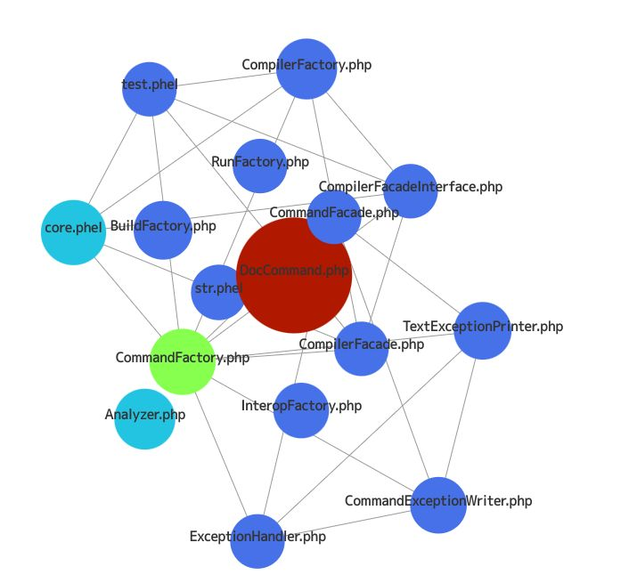

# Saraudon

A command to Visualize result of `git log --stat`


## Install

(not yet supported)

```bash
$ composer require --dev smeghead/phel-saraudon
```

## Execute

```bash
$ git log --stat -n 20 | vendor/bin/phel run src/main.phel -- src > output.html
```

Run the `git log` command for another directory, parse the results and save the html content in `output.html`.

```bash
$ GIT_WORK_TREE=/usr/target-project GIT_DIR=/usr/target-project/.git git log --stat -n 50 | vendor/bin/phel run src/main.phel -- src > output.html
```

## Example

Visualization of the history of the last 50 commits of `php-class-diagram`.

[example-output-page](https://smeghead.github.io/phel-saraudon/example/output.html)



## Development

### docker

```bash
$ docker compose build 
$ docker compose run --rm php_cli bash
# composer install
```


